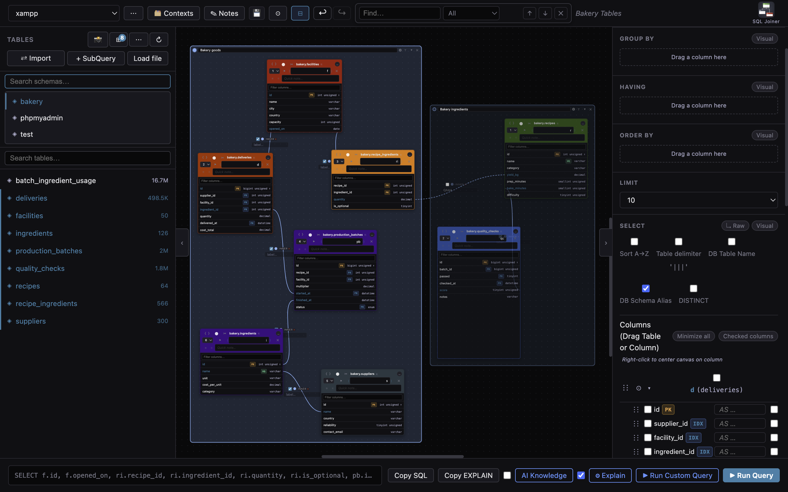

# SQL Joiner

A visual SQL query builder for MySQL.

Build SELECT queries by dragging tables onto a canvas, connecting them with joins, and setting conditions — all without writing SQL by hand.



## Features

- **Visual canvas** — drag tables from the sidebar onto the canvas, then draw join lines between columns
- **Join types** — INNER, LEFT, RIGHT, FULL OUTER, CROSS
- **SELECT builder** — pick columns visually or switch to raw SQL mode; supports column aliases, DISTINCT, custom expressions, and alpha sort
- **WHERE / GROUP BY / HAVING / ORDER BY** — visual or raw SQL mode for each clause
- **Subqueries** — add a subquery as a named table on the canvas
- **Import SQL** — paste an existing query to reverse-engineer it onto the canvas
- **Contexts** — save and restore canvas states (tables, joins, conditions)
- **Notes** — attach freeform notes to a context
- **Connection profiles** — store multiple MySQL connection profiles; switch between them from the top bar
- **Query cancellation** — cancel a running query mid-execution
- **Results grid** — paginated results with copy-to-clipboard support
- **Canvas search** — find tables, aliases, joins, or island labels

## Tech stack

| Layer | Technology |
|-------|-----------|
| Desktop shell | Electron |
| Backend | PHP (built-in CLI server) |
| Frontend | Vanilla JS + Canvas API |
| Database | MySQL (via PDO) |

## Requirements

- **Development:** Node.js, PHP 8+ on `$PATH`
- **Packaged app:** PHP binary is bundled (Windows & Mac builds include it under `php-bin/`)

## Getting started

```bash
# Install Electron dependencies
npm install

# Run in development mode
npm start
```

## Building

```bash
npm run build:mac    # macOS DMG
npm run build:win    # Windows installer (NSIS)
npm run build:linux  # Linux AppImage
```

Output goes to `dist/`.

## Project structure

```
app/
  src/
    Core/       Request, Response, ContextManager, AboutManager
    Database/   Connection (PDO), ProfileManager, SchemaInspector
    Query/      QueryBuilder, QueryParser, JoinClause, WhereClause,
                GroupByClause, HavingClause, OrderByClause
  assets/
    js/         Canvas, joins, islands, autocomplete, undo/redo, results, profiles, api
  storage/      Connection profiles and saved contexts (JSON)
electron/
  main.js       Electron entry — starts the PHP server, opens the window
php-bin/        Bundled PHP binaries (win/, mac/, linux/)
```

## Connection profiles

Profiles are stored in `app/storage/profiles.json`. Each profile holds host, port, database, user, and password. Manage them via **Profiles** in the top bar.
